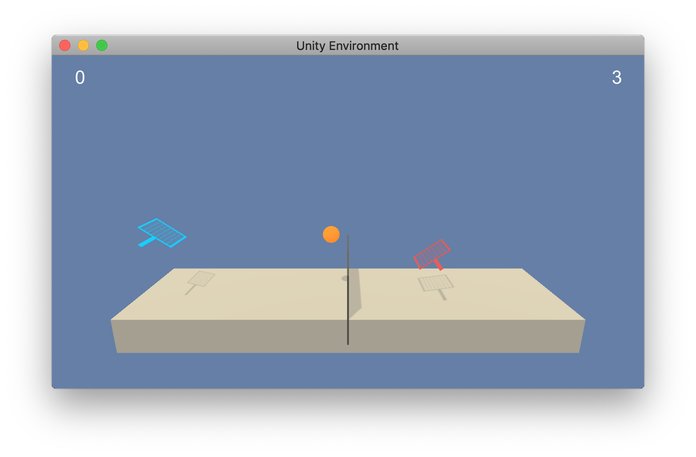

# Project 3: Collaboration and Competition
Udacity's Deep Reinforcement Learning Class

Student: Geoffrey Shmigelsky

## Project Overview

The purpose of this project is to train two reinforcement learning agents to win at the Tennis challenge. 

There are two agents passing a ball back and forth over a new. Each agent has to hit the sphere over the net to collect a reward of 0.1 per iteration. 

The state space has 24 dimensions per agent.

The agent has to learn how to best select the best of two (2) continuous actions that correspond to forward / backwards from the net or jump.

Success is defined by getting an average score over all arms of 0.5+ over 100 consecutive episodes.

### Requirements

You will need to install the libraries:

1. Numpy
2. Torch
3. MatplotLib

You will also need to setup a rlnd python kernel as described here in the class github repo:
https://github.com/udacity/deep-reinforcement-learning

### Getting Started

Start a jupyter notebook on the file:

- Tennis_Train.ipynb

Run all the cells to train an agent. 

To view a trained agent, simply run: 

- Tennis_Demo.ipynb

### Key Files
- Tennis_Train.ipynb - python notebook for training
- Tennis_Demo.ipynb - python notebook for demonstration
- checkpoint_actor.pth - saved actor model
- checkpoint_critic.pth - saved critic model
- model.py - Neural network for the DDPG
- ddpg_agent.py - Agent code to update the DDPG neural network
- scores_max.txt - history of scores for the model
- scores_both.txt - history of all agent's scores for the model
- times.txt - history of training times
- report.pdf - report for the project
